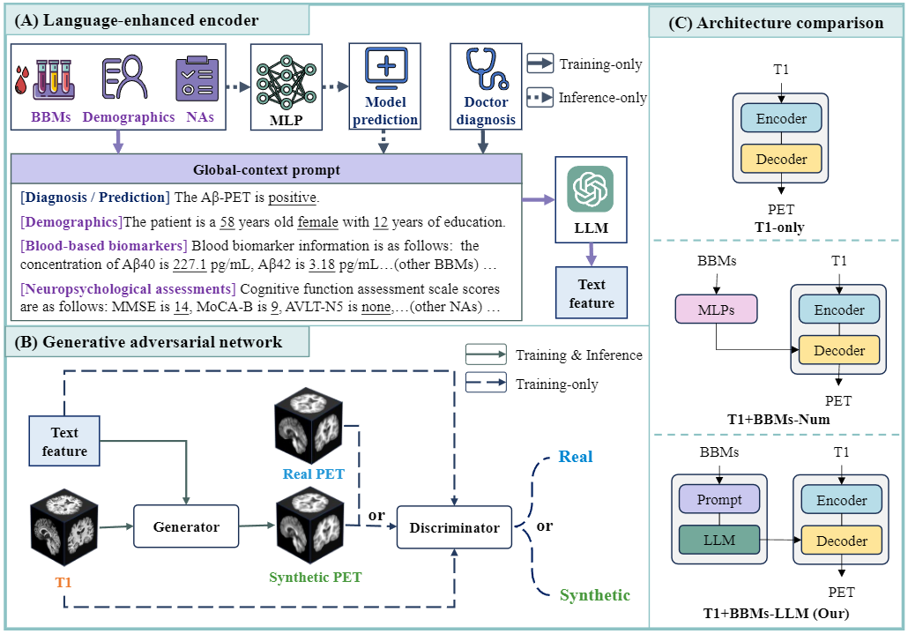

# Language-Enhanced Generative Modeling for PET Synthesis from MRI and Blood Biomarkers

Official implementation of  
**“Language-Enhanced Generative Modeling for PET Synthesis from MRI and Blood Biomarkers”**  
Paper: https://arxiv.org/abs/2511.02206

This repository provides the full pipeline for synthesizing individualized Aβ-PET images from T1-weighted MRI and blood-based biomarkers (BBMs), using a language-enhanced multimodal generative framework.

---

## Repository Structure

```
├── config/                     # Configuration files
│   ├── config/                 # YAML configs (training & model parameters)
│   └── setting/                # Argparse wrappers for frequently changed parameters
│
├── LLM/                        # Pretrained LLM weights (download from Hugging Face)
│
├── models/
│   ├── dcgan/                  # PET synthesis network (GAN generator + discriminator)
│   ├── Pytorch_ssim/           # SSIM computation module
│   └── ResNet3d/               # 3D ResNet classifier
│
├── utils/
│   ├── builder/                # Model builders / factory functions
│   └── trainer/                # Training & validation utilities
│
├── blood_cls.py                # ANN-based blood biomarker classifier
├── gen.py                      # Main PET synthesis script
├── train_cls.py                # PET / MRI classifier training
├── train_mcf.py                # Multimodal (MRI + BBM + PET) fusion model training
│
└── assets/
    └── model_architecture.png  # (optional) model architecture figure used in README
```

---

## Model Architecture

> Place your framework figure at: `assets/model_architecture.png`



---


## Installation

```bash
git clone https://github.com/your_repo_here/PET-Language-Enhanced-GenModel.git
cd PET-Language-Enhanced-GenModel
```

---

## LLM Checkpoint

Download a pretrained medical/biomedical LLM from Hugging Face and place the weights under:

```
./LLM/
```

Update the corresponding path in the YAML config files in `config/config/`.

---

## Usage

### 1. Generate PET Images

```bash
python gen.py --config config/config/synthesis.yaml
```

---

### 2. Train PET Synthesis Model (GAN)

```bash
python gen.py --config config/config/synthesis_train.yaml
```

---

### 3. Train Blood Biomarker ANN Classifier

```bash
python blood_cls.py --config config/config/blood_cls.yaml
```

---

### 4. Train PET / MRI Classifier

```bash
python train_cls.py --config config/config/train_cls.yaml
```

---

### 5. Train Multimodal Fusion Model (MRI + BBM + PET)

```bash
python train_mcf.py --config config/config/train_mcf.yaml
```

---

## Evaluation

Evaluation includes:

- Voxel-wise similarity  
- Region-wise Pearson correlation  
- SSIM / PSNR  
- Expert visual assessment  
- Amyloid-status classification AUC  
- Ablation analysis (LLM embedding, fusion strategy, modality contribution)

Run evaluation:

```bash
python utils/trainer/eval.py --config config/config/eval.yaml
```

---

## Configuration

- Global and model-specific parameters (YAML):  
  ```
  config/config/*.yaml
  ```

- Frequently changed options (paths, batch size, LR, device):  
  ```
  config/setting/*.py
  ```

You can either modify the YAMLs directly  
or override parameters using argparse defined in `config/setting`.

---

## Citation

```
@article{zhang2025languageenhancedgenerativemodelingpet,
    title={Language-Enhanced Generative Modeling for Amyloid PET Synthesis from MRI and Blood Biomarkers}, 
    author={Zhengjie Zhang and Xiaoxie Mao and Qihao Guo and Shaoting Zhang and Qi Huang and Mu Zhou and Fang Xie and Mianxin Liu},
    year={2025},
    eprint={2511.02206},
    archivePrefix={arXiv},
    url={https://arxiv.org/abs/2511.02206}, 
}
```


